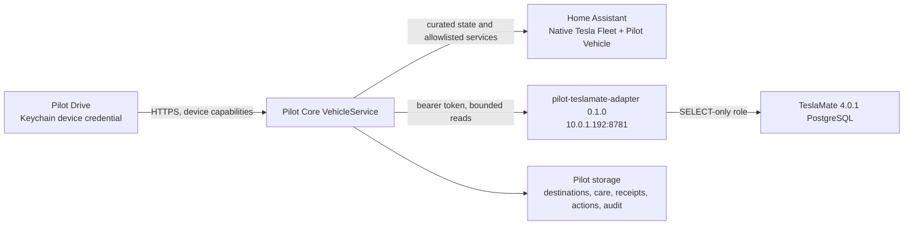

# Pilot Drive

## Sleeping and offline vehicles

Core persists the last normalized vehicle snapshot and merges it only into
missing live fields. Pilot Drive caches the vehicle list, selected vehicle,
overview and history atomically. A sleeping Tesla or provider outage therefore
retains the last SOC, stored energy and charge-limit requirement, clearly
marked stale rather than being presented as live telemetry.

Pilot Drive is a separate native SwiftUI application for iPhone and iPad on
iOS/iPadOS 17 or later. Its bundle identifier is
`com.jameshazell.pilotdrive`. The app has four surfaces: Car, Drives,
Charging, and Care.

## Trust boundary

Pilot Drive communicates only with the capability-scoped Pilot Core device
API. The phone never receives Tesla, Home Assistant, TeslaMate, PostgreSQL, or
MQTT credentials. Production pairing rejects plain HTTP and arbitrary hosts;
the one-time pairing payload supplies a trusted HTTPS Pilot Core origin. The
app has no arbitrary-load ATS exemption.

Production clients use `https://pilot.jameshomeautomation.work`. In the Pilot
Core administrator dashboard, choose the **Vehicle phone (Pilot Drive)**
capability profile and either create a short-lived pairing code or issue a
managed API key. A managed key is returned once inside a
`pilot.credentials.v1` JSON bundle; paste the complete bundle into Pilot Drive.
Pilot Core stores only the credential hash, and the device can be rotated or
revoked independently. Provider, Home Assistant, vLLM, and administrator
credentials are never included in the bundle or app binary.

The Vehicle phone pairing profile grants only:

- `portable-client`
- `vehicle-read`
- `vehicle-control`
- `vehicle-maintenance`

Provider identifiers, VINs, TeslaMate car IDs, Home Assistant entity IDs, and
secrets are excluded from device projections. Pilot Core exposes its private
administrator dashboard and bootstrap operations separately; secure remote
ingress must publish only the device API paths needed by paired clients.

## Data and command architecture



Home Assistant provides current state and explicitly configured controls.
TeslaMate remains the owner and authoritative source for historical drives,
charging sessions, efficiency, and estimated battery health. Pilot Core owns
saved destinations, maintenance, receipts, idempotent action requests, and
audit records.

Opening or refreshing Pilot Drive reads state and history only. It never sends
a wake command. Pilot Core maintains a Home Assistant WebSocket cache and uses
bounded fallback state reads when required.

## Tesla provider decision

Native Home Assistant Tesla Fleet is the sole current-state/control provider.
The `pilot_vehicle.send_navigation` custom service is the only route bridge; it
accepts a native HA device target and bounded coordinates, then calls the
signed Fleet `navigation_gps_request` command. Pilot Core never receives Tesla
credentials, VINs, or provider identifiers. TeslaMate remains the historical
source and its MQTT synchronisation is unchanged.

Fleet setup requires a Tesla Developer application with Vehicle Information,
Vehicle Location, and Vehicle Commands scopes, the public key at
`https://ip.jameshomeautomation.work/.well-known/appspecific/com.tesla.3p.public-key.pem`,
and virtual-key enrollment for Jarvis. Keep Tesla Custom available during the
rollout and disable it only after native controls and one physically confirmed
route pass; see `docs/HOME_ASSISTANT_TESLA_FLEET_MIGRATION.md`.

## TeslaMate adapter deployment

The adapter release is pinned to `pilot-teslamate-adapter:0.1.0` and is
designed to run beside TeslaMate on `10.0.1.192`. It provides only health,
cars, paginated drives, bounded drive positions, paginated charges, and the
qualified-session battery estimate. It has no arbitrary SQL or mutation
endpoint.

On the TeslaMate host, create the database role once as the existing database
owner. Supply generated values to psql variables rather than placing them in
shell history:

```bash
psql -v pilot_role=pilot_teslamate_reader \
  -v pilot_password='GENERATED_DATABASE_PASSWORD' \
  -f apps/teslamate-adapter/deploy/create-readonly-role.sql
```

Create two files inside a root-traversable-only `secrets/` directory under
`infra/teslamate-adapter/secrets/`:

- `teslamate_database_url`: PostgreSQL DSN for the SELECT-only role.
- `teslamate_adapter_token`: an independent random bearer token of at least 32
  characters. The same value is installed in Pilot Core's
  `teslamate_adapter_token` secret.

The adapter container runs as UID 10002. With non-Swarm Docker Compose, secret
files are bind-mounted and retain host mode bits; use mode `0404` inside the
root-only directory so the unprivileged process can read the mount without
making the enclosing directory traversable to host users.

Deploy and verify without changing the TeslaMate schema:

```bash
docker compose -f infra/teslamate-adapter/docker-compose.pilot.yml build
docker compose -f infra/teslamate-adapter/docker-compose.pilot.yml up -d
curl --fail http://10.0.1.192:8781/readyz
```

The ready endpoint confirms that the database session is read-only. The test
fixture also attempts a write as the adapter role and must be denied.

## Product behaviour

The Car surface shows battery SOC, estimated stored usable energy, estimated
energy required to reach the charge limit, range, vehicle and charging state,
freshness, location name, odometer, cabin/outside temperature, locks and
closures, provider health, and four tyre corners. Energy estimates use the
configured usable-capacity baseline and are labelled as estimates. Tyre
readings outside 1.5–4.0 bar after unit normalization are labelled
`abnormal_unverified`.

The Drives surface searches downloaded history and loads a bounded MapKit
polyline on demand. It shows distance, duration, SOC change, estimated energy,
Wh/km, speed, temperatures, and incomplete/truncated warnings.

The Charging surface combines the current Home Assistant session with
TeslaMate history. Battery health uses TeslaMate's qualified completed-session
method, the latest 100 qualifying capacity samples, and either an optional
manual baseline or the observed maximum. The UI always calls it an estimate,
shows sample coverage, and displays insufficient data without manufacturing a
capacity value.

The Care surface stores completed work, schedules, costs, workshop, notes,
next due date/odometer, warning leads, and bounded JPEG/HEIC/PDF receipts in
Pilot Core. Defaults are 30 days and 1,000 km. Reminders are in-app only.

Saved destinations include a name, address, coordinates, icon, climate flag,
optional temperature override, and optional front-right seat climate mode.
The destination editor can search MapKit for an address or place, populate the
required address and coordinates, and still supports moving the pin manually.
Use **Send to Jarvis** to run the destination workflow immediately without
saving the place; **Save** keeps it as a reusable Quick Destination.
The supported seat modes are off; heat low, medium, and high; and cool low,
medium, and high. A one-tap request is idempotent on the server and reports
wake, climate, temperature, front-right seat, and route independently. A
climate or seat failure does not block the route and Pilot Core never issues an
automatic compensating command. The result sheet offers explicit retry and
Stop Climate actions.

When Tesla Fleet has a route loaded, the Car surface also shows the active
Tesla navigation destination, remaining distance, arrival estimate, and
estimated state of charge at arrival. These are separate from Pilot Drive's
saved quick destinations. Enable the native Fleet entities **Destination**
and **State of charge at arrival** in Home Assistant if they are disabled by
default; the configured entity IDs are `sensor.jarvis_destination` and
`sensor.jarvis_state_of_charge_at_arrival`.

Controls are rendered only when configured in Pilot Core. Unlock, remote
start, HomeLink, valet changes, closure/window movement, and software install
require Face ID or device passcode followed by a single-use server
confirmation that expires after 120 seconds. Button-only commands with no
observable state end as `unverified`, never as confirmed success.

## Rollout and rollback

Secure HTTPS ingress is a launch prerequisite. Do not install a production
build or test vehicle commands through an HTTP LAN exception.

1. Build and deploy adapter `0.1.0`; compare car, drive, charge, and battery
   results against TeslaMate. Do not alter the TeslaMate schema.
2. Build and deploy Pilot Core `0.30.2`; pair a read-only Vehicle phone and
   confirm repeated app opens never wake the car.
3. With the car parked and physically observed, enable and test low-risk
   controls one at a time.
4. Test each biometric action separately, then one complete saved-destination
   workflow.
5. Verify secure remote HTTPS, credential rotation and revocation, Core
   restart, Wi-Fi loss, and independent Home Assistant/TeslaMate outages.

Roll back by restoring the previous immutable Pilot Core image/config and
stopping the adapter sidecar. The adapter owns no database schema or data, so
removing it requires no TeslaMate rollback. Preserve Pilot Core's vehicle
records and receipt directory when reverting software.

## Validation commands

```bash
python -m unittest discover -s apps/pilot-core/tests -v
python -m unittest discover -s apps/teslamate-adapter/tests -v
apps/teslamate-adapter/tests/integration/run.sh
xcrun swift test --package-path packages/PilotClientKit
xcodebuild -project apps/pilot-drive/PilotDrive.xcodeproj \
  -scheme PilotDrive -sdk iphonesimulator \
  -destination 'platform=iOS Simulator,name=iPhone 17' \
  CODE_SIGNING_ALLOWED=NO test
```

Software validation is not vehicle acceptance. Record the physical result,
observer, time, vehicle state, and rollback outcome separately for:

- wake and no-wake-on-view
- HVAC on/off and temperature
- route arrival on the Tesla touchscreen
- charging start/stop and charge limit
- lock and unlock
- frunk, trunk, and windows
- remote start and valet
- flash and horn
- software installation

Do not infer touchscreen route arrival, a moving closure, or a charging state
change from an HTTP 2xx response.
